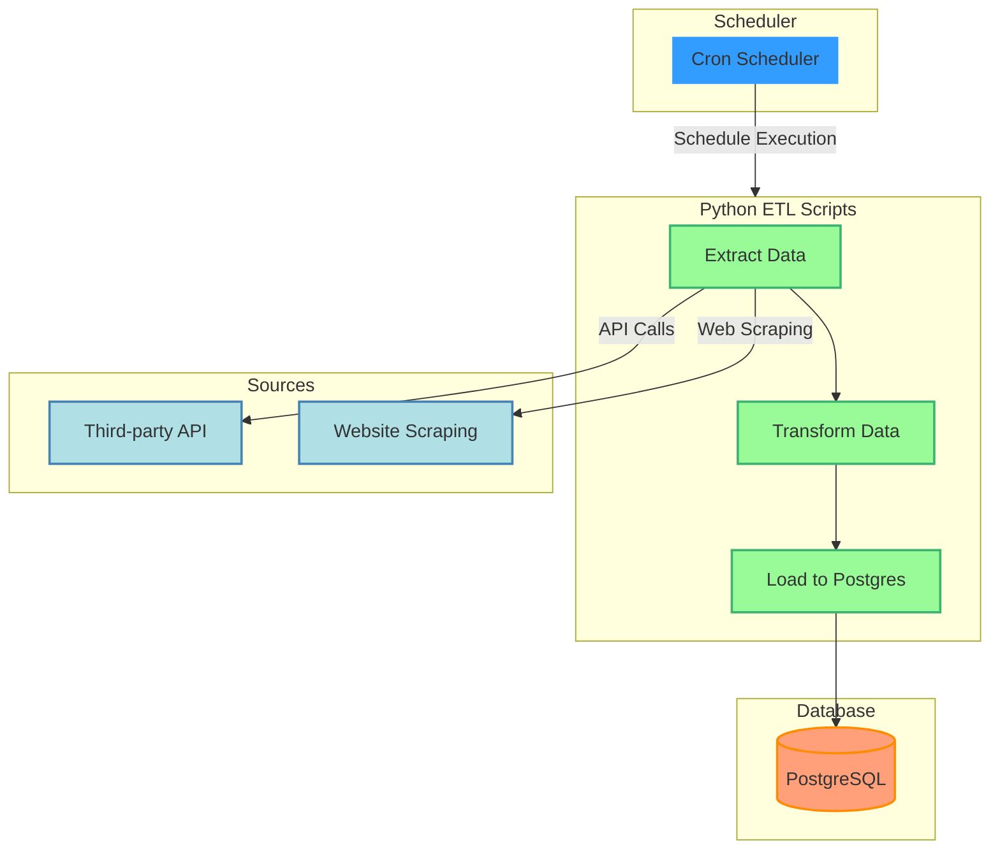

# HyperLiquid Protocol Pipeline
- TBA

## Architecture

```mermaid
    flowchart TD
        subgraph Scheduler
            CRON[[Cron Scheduler]]
        end

        subgraph ETL[Python ETL Scripts]
            EXTRACT[Extract Data] --> TRANSFORM[Transform Data] --> LOAD[Load to Postgres]
        end

        subgraph Sources
            API[Third-party API]
            WEB[Website Scraping]
        end

        subgraph Database
            PG[(PostgreSQL)]
        end

        CRON --> |Schedule Execution| ETL
        EXTRACT --> |API Calls| API
        EXTRACT --> |Web Scraping| WEB
        LOAD --> PG

        classDef cron fill:#339cff,stroke:#339cff,stroke-width:2px,color:#333
        classDef etl fill:#98FB98,stroke:#3CB371,stroke-width:2px,color:#333
        classDef sources fill:#B0E0E6,stroke:#4682B4,stroke-width:2px,color:#333
        classDef db fill:#FFA07A,stroke:#FF8C00,stroke-width:2px,color:#333

        class CRON cron
        class EXTRACT,TRANSFORM,LOAD etl
        class API,WEB sources
        class PG db
```
