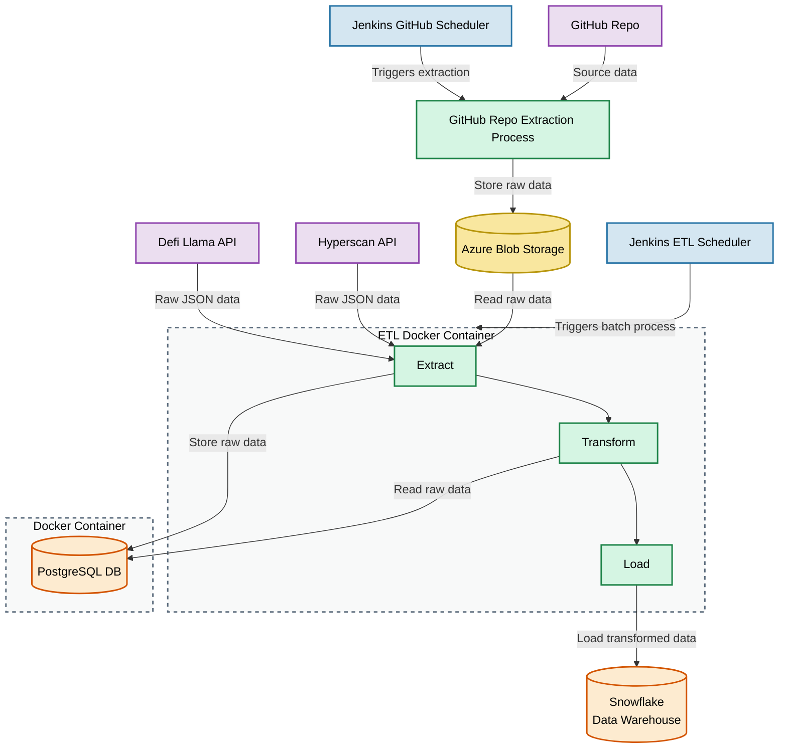

# HyperLiquid Protocol/Token Metrics Pipeline
- TBA

## Architecture

```mermaid
flowchart TD
    %% Main schedulers
    JenkinsETL["Jenkins ETL Scheduler"]
    JenkinsGit["Jenkins GitHub Scheduler"]
    
    subgraph ETLContainer["ETL Docker Container"]
        E["Extract"] --> T["Transform"]
        T --> L["Load"]
    end
    
    subgraph PostgresContainer["Docker Container"]
        PostgreSQL[("PostgreSQL DB")]
    end
    
    %% Storage components
    AzureBlob[("Azure Blob Storage")]
    
    %% External components
    FinAPI1["Defi Llama API"]
    FinAPI2["Hyperscan API"] 
    GitHubRepo["GitHub Repo"]
    GitHubExtract["GitHub Repo Extraction Process"]
    Snowflake[("Snowflake\nData Warehouse")]
    
    %% Relationships
    JenkinsETL -->|"Triggers batch process"| ETLContainer
    JenkinsGit -->|"Triggers extraction"| GitHubExtract
    
    FinAPI1 -->|"Raw JSON data"| E
    FinAPI2 -->|"Raw JSON data"| E
    
    GitHubRepo -->|"Source data"| GitHubExtract
    GitHubExtract -->|"Store raw data"| AzureBlob
    AzureBlob -->|"Read raw data"| E
    
    E -->|"Store raw data"| PostgreSQL
    T -->|"Read raw data"| PostgreSQL
    L -->|"Load transformed data"| Snowflake
    
    %% Styling with black text
    classDef scheduler fill:#d4e6f1,stroke:#2874a6,stroke-width:2px,color:#000000
    classDef process fill:#d5f5e3,stroke:#1e8449,stroke-width:2px,color:#000000
    classDef database fill:#fdebd0,stroke:#d35400,stroke-width:2px,color:#000000
    classDef storage fill:#f9e79f,stroke:#b7950b,stroke-width:2px,color:#000000
    classDef external fill:#ebdef0,stroke:#8e44ad,stroke-width:2px,color:#000000
    classDef container fill:#f8f9f9,stroke:#5d6d7e,stroke-width:2px,stroke-dasharray:5,color:#000000
    
    class JenkinsETL,JenkinsGit scheduler
    class E,T,L,GitHubExtract process
    class PostgreSQL,Snowflake database
    class AzureBlob storage
    class FinAPI1,FinAPI2,GitHubRepo external
    class ETLContainer,PostgresContainer container
```